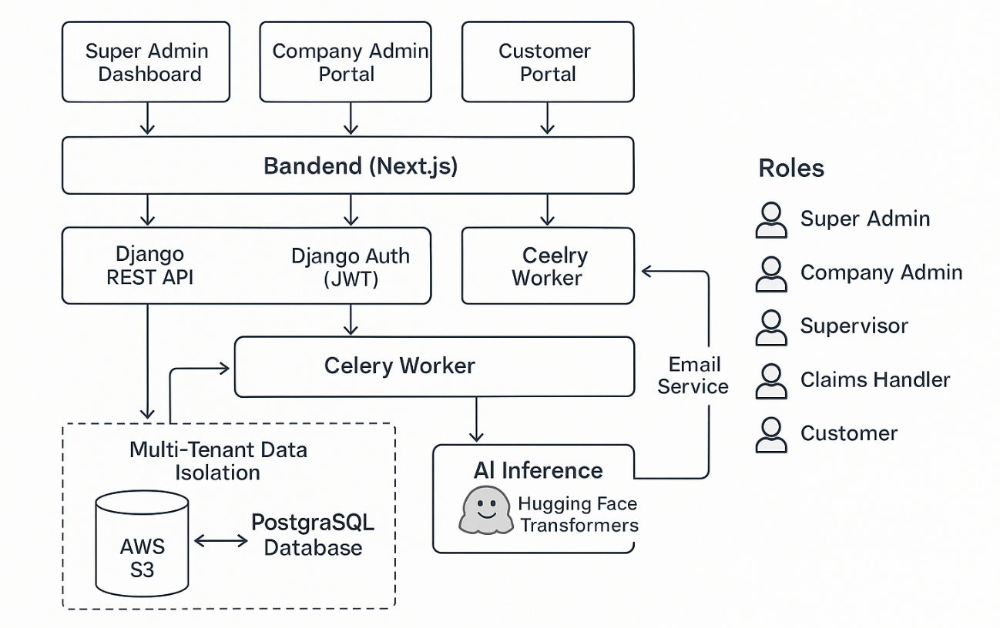

# ✨ Multitenancy Concept for SmartClaim AI

| Role                                          | What They Can Do                                                               |
| --------------------------------------------- | ------------------------------------------------------------------------------ |
| **Super Admin**(Platform owner)         | Full access to all companies, claims, users. Django Admin panel.               |
| **Company Admin**(Insurance firm staff) | Manage only their company’s claims and customers. Access a limited dashboard. |
| **Customer**(End User)                  | Submit claims only under their own company. Track their own claims.            |

---

# 🔥 Now, More Specifically:

* **Django Admin Panel:**
  * Mainly for the **Super Admin** (platform owner) to create/approve new companies, manage everything if needed.
* **Custom Company Admin Portal:**
  * You will build a separate frontend view (maybe `/company-admin/`) where **Company Admins** log in.
  * They can see **only** their firm's claims and users.

---

# 🛠️ How to Structure This in Django (High-Level)

You add a new model: `Company`.

<pre class="overflow-visible!" data-start="1457" data-end="1713">

python

<button class="flex gap-1 items-center select-none px-4 py-1" aria-label="Copy"><svg width="24" height="24" viewBox="0 0 24 24" fill="none" xmlns="http://www.w3.org/2000/svg" class="icon-xs"><path fill-rule="evenodd" clip-rule="evenodd" d="M7 5C7 3.34315 8.34315 2 10 2H19C20.6569 2 22 3.34315 22 5V14C22 15.6569 20.6569 17 19 17H17V19C17 20.6569 15.6569 22 14 22H5C3.34315 22 2 20.6569 2 19V10C2 8.34315 3.34315 7 5 7H7V5ZM9 7H14C15.6569 7 17 8.34315 17 10V15H19C19.5523 15 20 14.5523 20 14V5C20 4.44772 19.5523 4 19 4H10C9.44772 4 9 4.44772 9 5V7ZM5 9C4.44772 9 4 9.44772 4 10V19C4 19.5523 4.44772 20 5 20H14C14.5523 20 15 19.5523 15 19V10C15 9.44772 14.5523 9 14 9H5Z" fill="currentColor"></path></svg>Copy</button><button class="flex items-center gap-1 px-4 py-1 select-none"><svg width="24" height="24" viewBox="0 0 24 24" fill="none" xmlns="http://www.w3.org/2000/svg" class="icon-xs"><path d="M2.5 5.5C4.3 5.2 5.2 4 5.5 2.5C5.8 4 6.7 5.2 8.5 5.5C6.7 5.8 5.8 7 5.5 8.5C5.2 7 4.3 5.8 2.5 5.5Z" fill="currentColor" stroke="currentColor" stroke-linecap="round" stroke-linejoin="round"></path><path d="M5.66282 16.5231L5.18413 19.3952C5.12203 19.7678 5.09098 19.9541 5.14876 20.0888C5.19933 20.2067 5.29328 20.3007 5.41118 20.3512C5.54589 20.409 5.73218 20.378 6.10476 20.3159L8.97693 19.8372C9.72813 19.712 10.1037 19.6494 10.4542 19.521C10.7652 19.407 11.0608 19.2549 11.3343 19.068C11.6425 18.8575 11.9118 18.5882 12.4503 18.0497L20 10.5C21.3807 9.11929 21.3807 6.88071 20 5.5C18.6193 4.11929 16.3807 4.11929 15 5.5L7.45026 13.0497C6.91175 13.5882 6.6425 13.8575 6.43197 14.1657C6.24513 14.4392 6.09299 14.7348 5.97903 15.0458C5.85062 15.3963 5.78802 15.7719 5.66282 16.5231Z" stroke="currentColor" stroke-width="2" stroke-linecap="round" stroke-linejoin="round"></path><path d="M14.5 7L18.5 11" stroke="currentColor" stroke-width="2" stroke-linecap="round" stroke-linejoin="round"></path></svg>Edit</button>

<code class="whitespace-pre! language-python">classCompany(models.Model):
    name = models.CharField(max_length=255)
    address = models.TextField()
    logo = models.ImageField(upload_to='company_logos/', null=True, blank=True)
    created_at = models.DateTimeField(auto_now_add=True)
</code>

</pre>

Extend your **User** model (via `AbstractUser`) to  **link users to a company** :

<pre class="overflow-visible!" data-start="1796" data-end="2208">

python

<button class="flex gap-1 items-center select-none px-4 py-1" aria-label="Copy"><svg width="24" height="24" viewBox="0 0 24 24" fill="none" xmlns="http://www.w3.org/2000/svg" class="icon-xs"><path fill-rule="evenodd" clip-rule="evenodd" d="M7 5C7 3.34315 8.34315 2 10 2H19C20.6569 2 22 3.34315 22 5V14C22 15.6569 20.6569 17 19 17H17V19C17 20.6569 15.6569 22 14 22H5C3.34315 22 2 20.6569 2 19V10C2 8.34315 3.34315 7 5 7H7V5ZM9 7H14C15.6569 7 17 8.34315 17 10V15H19C19.5523 15 20 14.5523 20 14V5C20 4.44772 19.5523 4 19 4H10C9.44772 4 9 4.44772 9 5V7ZM5 9C4.44772 9 4 9.44772 4 10V19C4 19.5523 4.44772 20 5 20H14C14.5523 20 15 19.5523 15 19V10C15 9.44772 14.5523 9 14 9H5Z" fill="currentColor"></path></svg>Copy</button><button class="flex items-center gap-1 px-4 py-1 select-none"><svg width="24" height="24" viewBox="0 0 24 24" fill="none" xmlns="http://www.w3.org/2000/svg" class="icon-xs"><path d="M2.5 5.5C4.3 5.2 5.2 4 5.5 2.5C5.8 4 6.7 5.2 8.5 5.5C6.7 5.8 5.8 7 5.5 8.5C5.2 7 4.3 5.8 2.5 5.5Z" fill="currentColor" stroke="currentColor" stroke-linecap="round" stroke-linejoin="round"></path><path d="M5.66282 16.5231L5.18413 19.3952C5.12203 19.7678 5.09098 19.9541 5.14876 20.0888C5.19933 20.2067 5.29328 20.3007 5.41118 20.3512C5.54589 20.409 5.73218 20.378 6.10476 20.3159L8.97693 19.8372C9.72813 19.712 10.1037 19.6494 10.4542 19.521C10.7652 19.407 11.0608 19.2549 11.3343 19.068C11.6425 18.8575 11.9118 18.5882 12.4503 18.0497L20 10.5C21.3807 9.11929 21.3807 6.88071 20 5.5C18.6193 4.11929 16.3807 4.11929 15 5.5L7.45026 13.0497C6.91175 13.5882 6.6425 13.8575 6.43197 14.1657C6.24513 14.4392 6.09299 14.7348 5.97903 15.0458C5.85062 15.3963 5.78802 15.7719 5.66282 16.5231Z" stroke="currentColor" stroke-width="2" stroke-linecap="round" stroke-linejoin="round"></path><path d="M14.5 7L18.5 11" stroke="currentColor" stroke-width="2" stroke-linecap="round" stroke-linejoin="round"></path></svg>Edit</button>

<code class="whitespace-pre! language-python">from django.contrib.auth.models import AbstractUser

classUser(AbstractUser):
    company = models.ForeignKey(Company, null=True, blank=True, on_delete=models.SET_NULL)
    ROLE_CHOICES = (
        ('superadmin', 'Super Admin'),
        ('company_admin', 'Company Admin'),
        ('customer', 'Customer'),
    )
    role = models.CharField(max_length=20, choices=ROLE_CHOICES, default='customer')
</code>

</pre>

Every **Claim** would also link to a Company:

<pre class="overflow-visible!" data-start="2257" data-end="2433">

python

<button class="flex gap-1 items-center select-none px-4 py-1" aria-label="Copy"><svg width="24" height="24" viewBox="0 0 24 24" fill="none" xmlns="http://www.w3.org/2000/svg" class="icon-xs"><path fill-rule="evenodd" clip-rule="evenodd" d="M7 5C7 3.34315 8.34315 2 10 2H19C20.6569 2 22 3.34315 22 5V14C22 15.6569 20.6569 17 19 17H17V19C17 20.6569 15.6569 22 14 22H5C3.34315 22 2 20.6569 2 19V10C2 8.34315 3.34315 7 5 7H7V5ZM9 7H14C15.6569 7 17 8.34315 17 10V15H19C19.5523 15 20 14.5523 20 14V5C20 4.44772 19.5523 4 19 4H10C9.44772 4 9 4.44772 9 5V7ZM5 9C4.44772 9 4 9.44772 4 10V19C4 19.5523 4.44772 20 5 20H14C14.5523 20 15 19.5523 15 19V10C15 9.44772 14.5523 9 14 9H5Z" fill="currentColor"></path></svg>Copy</button><button class="flex items-center gap-1 px-4 py-1 select-none"><svg width="24" height="24" viewBox="0 0 24 24" fill="none" xmlns="http://www.w3.org/2000/svg" class="icon-xs"><path d="M2.5 5.5C4.3 5.2 5.2 4 5.5 2.5C5.8 4 6.7 5.2 8.5 5.5C6.7 5.8 5.8 7 5.5 8.5C5.2 7 4.3 5.8 2.5 5.5Z" fill="currentColor" stroke="currentColor" stroke-linecap="round" stroke-linejoin="round"></path><path d="M5.66282 16.5231L5.18413 19.3952C5.12203 19.7678 5.09098 19.9541 5.14876 20.0888C5.19933 20.2067 5.29328 20.3007 5.41118 20.3512C5.54589 20.409 5.73218 20.378 6.10476 20.3159L8.97693 19.8372C9.72813 19.712 10.1037 19.6494 10.4542 19.521C10.7652 19.407 11.0608 19.2549 11.3343 19.068C11.6425 18.8575 11.9118 18.5882 12.4503 18.0497L20 10.5C21.3807 9.11929 21.3807 6.88071 20 5.5C18.6193 4.11929 16.3807 4.11929 15 5.5L7.45026 13.0497C6.91175 13.5882 6.6425 13.8575 6.43197 14.1657C6.24513 14.4392 6.09299 14.7348 5.97903 15.0458C5.85062 15.3963 5.78802 15.7719 5.66282 16.5231Z" stroke="currentColor" stroke-width="2" stroke-linecap="round" stroke-linejoin="round"></path><path d="M14.5 7L18.5 11" stroke="currentColor" stroke-width="2" stroke-linecap="round" stroke-linejoin="round"></path></svg>Edit</button>

<code class="whitespace-pre! language-python">classClaim(models.Model):
    user = models.ForeignKey(User, on_delete=models.CASCADE)
    company = models.ForeignKey(Company, on_delete=models.CASCADE)
    ...
</code>

</pre>

---

# ⚡ How Access Control Would Work:

* **DRF permissions** will filter claims and users  **based on the requesting user's company** .
* **Super Admins** see everything.
* **Company Admins** only see claims where `claim.company == request.user.company`.
* **Customers** can only CRUD  **their own claims** .

---

# 🎯 Practical Example of Workflow:

| Step | Who                                                              | Action                     |
| ---- | ---------------------------------------------------------------- | -------------------------- |
| 1    | Insurance firm (company admin)                                   | Registers company account. |
| 2    | Company admin invites customers via email or registration link.  |                            |
| 3    | Customers log in under the company, upload claims.               |                            |
| 4    | Company admin sees/manage only**their company's claims** . |                            |
| 5    | Super Admin can audit/manage all companies via Django Admin.     |                            |

---

# ✨ Bonus:

* Their email templates.
* Their dashboard branding (e.g., logo in top left corner).
* Their claim approval workflows (optional).
* Multitenancy (companies/firms)
* Role-Based Access Control within companies
* Support for multiple **staff roles** inside a company (claims handler, supervisor, etc.)
* Super admin oversight

---

# 📄 SmartClaim AI — Full, Updated Project Documentation (Multitenant Edition)

---

## 1. Executive Summary

**SmartClaim AI** is a multi-tenant, AI-powered platform that automates insurance claim submission and evaluation.

Multiple **insurance companies** can register independently.

Each company can manage its own **staff roles** and  **customers** .

Customers upload  **documents, images, and videos** ; AI models automate parsing, classification, summarization, prioritization, and fraud detection.

> **Real-World Problem:**
>
> Insurance firms need faster, smarter, and fraud-resistant claim handling while maintaining data segregation across businesses.

---

## 2. Requirements Analysis

### 2.1 Functional Requirements

* ✅ Company registration and management
* ✅ Staff role assignment within each company:
  * Claims Handler (can process claims)
  * Supervisor (approves/rejects claims)
  * Company Admin (manages company settings and users)
* ✅ Customer registration linked to companies
* ✅ Customer claim submission with multi-file support
* ✅ Document parsing, image classification, video classification
* ✅ Text summarization of descriptions
* ✅ Severity scoring and prioritization
* ✅ Fraud risk flagging
* ✅ Staff dashboards filtered by company
* ✅ Email notifications for claim updates
* ✅ Super Admin dashboard for platform-wide management

### 2.2 Non-Functional Requirements

* 🔒 Multitenancy security: strict company data isolation
* 🚀 Asynchronous processing of AI inference
* 📈 Audit logs of all critical actions
* ☁️ Scalable cloud deployment
* 🛠️ Extensible AI model pipeline
* 🖥️ Mobile-friendly design

---

## 3. System Design Overview

### 3.1 Core Technologies

| Layer            | Technology                               |
| ---------------- | ---------------------------------------- |
| Frontend         | Next.js + TailwindCSS                    |
| Backend          | Django + Django Rest Framework (DRF)     |
| Background Tasks | Celery + Redis                           |
| Database         | PostgreSQL (multi-tenant friendly)       |
| File Storage     | AWS S3 / MinIO                           |
| AI Inference     | Hugging Face Transformers, Inference API |
| Deployment       | Docker + AWS (EC2 + RDS + S3)            |

---

### 3.2 Django Apps Architecture

<pre class="overflow-visible!" data-start="2379" data-end="2853">

bash

<button class="flex gap-1 items-center select-none px-4 py-1" aria-label="Copy"><svg width="24" height="24" viewBox="0 0 24 24" fill="none" xmlns="http://www.w3.org/2000/svg" class="icon-xs"><path fill-rule="evenodd" clip-rule="evenodd" d="M7 5C7 3.34315 8.34315 2 10 2H19C20.6569 2 22 3.34315 22 5V14C22 15.6569 20.6569 17 19 17H17V19C17 20.6569 15.6569 22 14 22H5C3.34315 22 2 20.6569 2 19V10C2 8.34315 3.34315 7 5 7H7V5ZM9 7H14C15.6569 7 17 8.34315 17 10V15H19C19.5523 15 20 14.5523 20 14V5C20 4.44772 19.5523 4 19 4H10C9.44772 4 9 4.44772 9 5V7ZM5 9C4.44772 9 4 9.44772 4 10V19C4 19.5523 4.44772 20 5 20H14C14.5523 20 15 19.5523 15 19V10C15 9.44772 14.5523 9 14 9H5Z" fill="currentColor"></path></svg>Copy</button><button class="flex items-center gap-1 px-4 py-1 select-none"><svg width="24" height="24" viewBox="0 0 24 24" fill="none" xmlns="http://www.w3.org/2000/svg" class="icon-xs"><path d="M2.5 5.5C4.3 5.2 5.2 4 5.5 2.5C5.8 4 6.7 5.2 8.5 5.5C6.7 5.8 5.8 7 5.5 8.5C5.2 7 4.3 5.8 2.5 5.5Z" fill="currentColor" stroke="currentColor" stroke-linecap="round" stroke-linejoin="round"></path><path d="M5.66282 16.5231L5.18413 19.3952C5.12203 19.7678 5.09098 19.9541 5.14876 20.0888C5.19933 20.2067 5.29328 20.3007 5.41118 20.3512C5.54589 20.409 5.73218 20.378 6.10476 20.3159L8.97693 19.8372C9.72813 19.712 10.1037 19.6494 10.4542 19.521C10.7652 19.407 11.0608 19.2549 11.3343 19.068C11.6425 18.8575 11.9118 18.5882 12.4503 18.0497L20 10.5C21.3807 9.11929 21.3807 6.88071 20 5.5C18.6193 4.11929 16.3807 4.11929 15 5.5L7.45026 13.0497C6.91175 13.5882 6.6425 13.8575 6.43197 14.1657C6.24513 14.4392 6.09299 14.7348 5.97903 15.0458C5.85062 15.3963 5.78802 15.7719 5.66282 16.5231Z" stroke="currentColor" stroke-width="2" stroke-linecap="round" stroke-linejoin="round"></path><path d="M14.5 7L18.5 11" stroke="currentColor" stroke-width="2" stroke-linecap="round" stroke-linejoin="round"></path></svg>Edit</button>

<code class="whitespace-pre!">smartclaim/
├── accounts/           # Users, authentication, role management
├── companies/          # Company registration, profiles
├── claims/             # Claim submission, AI results, statuses
├── ai_processing/      # AI pipelines (document QA, classification, summarization)
├── notifications/      # Email notifications
├── audit/              # Action logs
├── common/             # Shared utilities
└── config/             # Django settings, Celery config
</code>

</pre>

---

## 4. Detailed Project Scope

### Phase 1 — Core MVP (Month 1)

* User registration (Customer, Company Admin)
* Company registration and approval by Super Admin
* Claim submission and file uploads
* Document parsing and image classification
* Simple dashboard for Customers and Company Admins
* Django Admin Panel for Super Admin

### Phase 2 — Advanced Multitenancy + AI (Month 2)

* Staff roles management (Claims Handler, Supervisor)
* Video classification pipeline
* Summarization pipeline
* Fraud risk text classification
* Celery background processing for AI tasks
* Audit trail for critical actions
* Company branding (logo, email templates)

### Phase 3 — Scaling & Full Features (Month 3)

* Advanced claim search, filter, sort
* Customer notification system (email on status updates)
* Rate limiting, monitoring
* Deployment on AWS with scalable storage (S3)
* Dashboard UI polish for staff and customers

---

## 5. Updated Database Schema Overview

| Table    | Fields                                                                                                | Relationships        |
| -------- | ----------------------------------------------------------------------------------------------------- | -------------------- |
| Company  | name, address, logo, created_at                                                                       | —                   |
| User     | username, email, password, role, company_id                                                           | FK to Company        |
| Claim    | title, description, files, AI results, user_id, company_id, status                                    | FK to User + Company |
| AIResult | claim_id, document_extraction, image_classification, video_classification, summarization, fraud_score | FK to Claim          |
| AuditLog | actor_id, action, timestamp, metadata                                                                 | FK to User           |

---

## 6. Hugging Face Tasks Integration Map

| Hugging Face Task           | Project Feature                          |
| --------------------------- | ---------------------------------------- |
| Document Question Answering | Parse insurance forms, invoices          |
| Image Classification        | Analyze accident photos                  |
| Video Classification        | Detect incident type from short videos   |
| Summarization               | Summarize customer incident descriptions |
| Text Classification         | Assess urgency, severity, fraud risk     |

---

## 7. Roles & Permissions

| Role           | Access Level                                    |
| -------------- | ----------------------------------------------- |
| Super Admin    | Manage all companies, users, claims             |
| Company Admin  | Manage company's users, staff, claims, settings |
| Supervisor     | Approve/reject/triage claims                    |
| Claims Handler | Process and update claims only                  |
| Customer       | Submit and track their own claims               |

---

# 📈 Updated High-Level System Architecture Diagram

